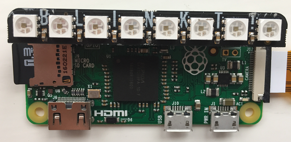

## Coding the lights

This part is optional. If you don't have a Blinkt or don't want to put lights on your time-lapse camera, you can skip this section.

- If you have not done so already, attach the Blinkt to your Pi Zero, ensuring that it is powered off first. The Blinkt must be attached with the curved edges matching the curved edges of the Pi Zero to avoid permanently damaging it.

  

- Once the Blinkt is attached and the Pi Zero is switched on, you can add some code to your program to control the lights.

- Add a new line of code with the other `import` statements to import the functions we need from the blinkt library:

  ```python
  from blinkt import set_pixel, set_brightness, show, clear
  ```

- Immediately after this line, create a function:

  ```python
  def lights():
    # Code will go here
  ```

- Inside this function you can put the code for your own light show. Here's a very simple example:

  ```python
  def lights():
      set_brightness(0.1)
      clear()
      set_pixel(0, 255, 0, 0)
      show()
      sleep(2)
      set_pixel(0, 0, 0, 0)
      show()
  ```

  This code does the following:
  - `set_brightness(0.1)` - the lights are pretty bright, so we turned them down a bit
  - `clear()` - clears any lights which may be on
  - `set_pixel(0, 255, 0, 0)` - sets pixel 0 (the pixels are numbered 0-7 starting on the left) to red. The first number is which pixel to set, and the last three numbers are a colour in RGB format.
  - `show()` - shows the pixels in the colours you just set.
  - `sleep(2)` - wait 2 seconds

- Add a line of code to call the function which shows the lights when a new picture is taken:

  ```python
  for filename in camera.capture_continuous('/home/pi/time-lapse/img{timestamp:%H-%M-%S-%f}.jpg'):
      lights()    # Add this line to call the light show
      time.sleep(WAIT_TIME)
  ```

- Add your own code for a light show. When writing the code for your light sequence, make sure that you do not include an infinite loop (`while True:`) within the function. If you do this, the flow of control within your program will get stuck within this loop and your camera will not take any more pictures. In the glasses example, we used [this code](resources/example_lights.py) to cause a red light to move across the screen and back twice.

