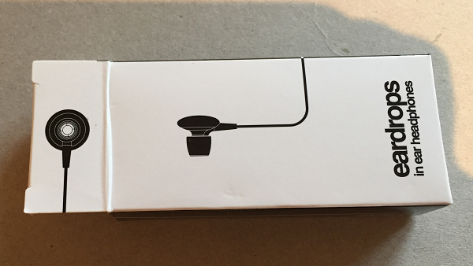
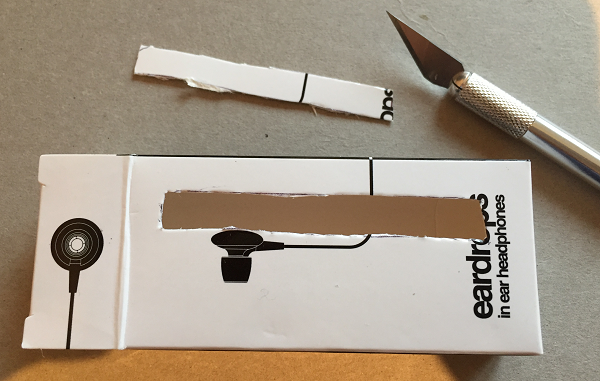
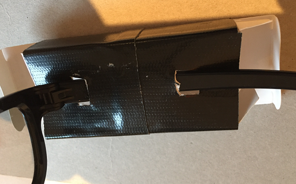
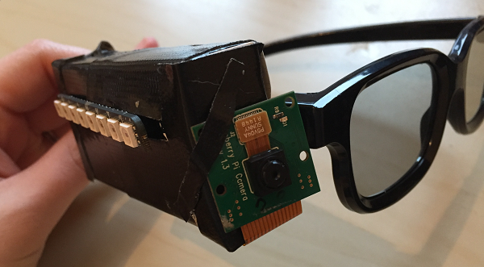

## Creating the wearable

Now that your code works, it's time to work out how you will make your Pi Zero wearable. You could make anything! Design a stylish case using a 3D printer or, at the opposite end of maker chic, build box using cardboard and gaffer tape. Here is how we made the glasses, to give you an example:

- Take a small box that the Pi Zero will fit inside. This could be a match box, or we found this old headphone box:

  

- If you are using lights, use a craft knife to carefully cut a hole in the box big enough for the lights to show through.

  

- Cut holes in the bottom of the box to allow access to the ports on the Pi Zero. Cut two holes in the back for the arm of the glasses. Insert the arm of the glasses through the holes to attach it to the box, being careful not to bend it too much. We covered the box with black gaffer tape to make it look cool and futuristic.

  

- Put the Pi Zero inside the box and close the ends. You can feed the camera cable through the closed flap and secure it onto the front of the box using more gaffer tape. Make sure that the camera is the right way up!

  

- Attach the USB power pack through the hole you cut in the bottom of the box. Turn it on to boot up the Pi Zero and start your time-lapse wearable.

