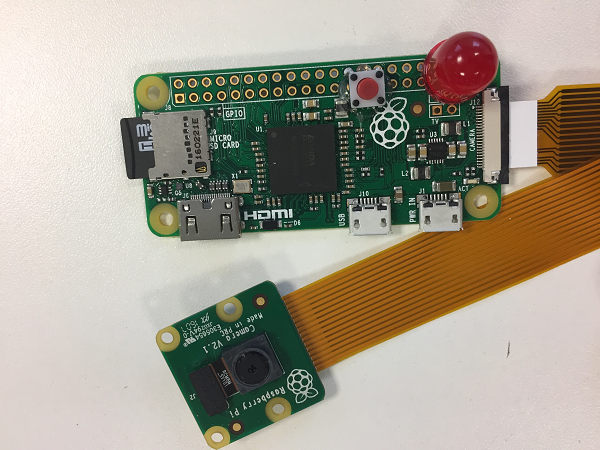

## Deciding on your wearable

First, you need to decide what kind of wearable you would like to make. The Pi Zero is very small and portable so you can wear it in various ways. Here are two examples of wearable time-lapse cameras that you could make with a Raspberry Pi Zero:

- You could use a lanyard to make a wearable camera that hangs round your neck. Your USB power pack could be stored in a shirt pocket close to the camera. Here is a basic wearable camera setup with a soldered-on LED to alert you when a photograph is being taken, and a button which could be programmed to start and stop photo capture sequences.

  

- You could attach your time-lapse camera to a pair of sunglasses so that it can see what you see. This make uses an additional piece of hardware called a [Blinkt](https://shop.pimoroni.com/products/blinkt), which allows the addition of a cool light pattern whenever a picture is captured. Adding these lights is completely optional. You could skip this part altogether, or you could add lights in a different way, for example by using individual LEDs.

  

- You may have your own idea about how you would like to wear your time-lapse camera! The most important thing to remember is that your wearable time-lapse camera will not be waterproof, so don't wear it outside in the rain (or in the shower).

