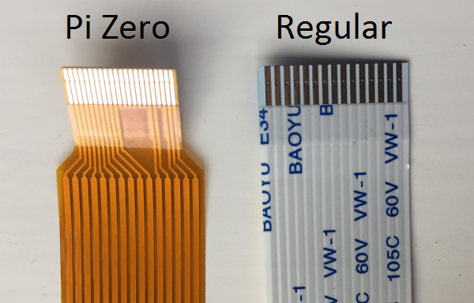
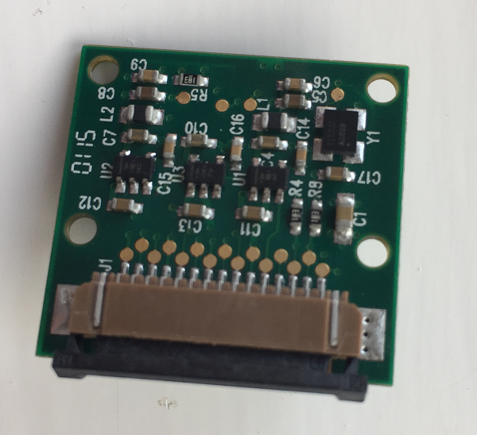
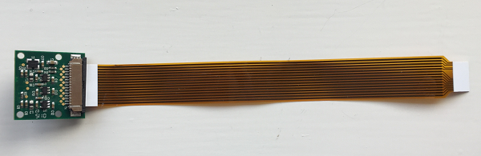
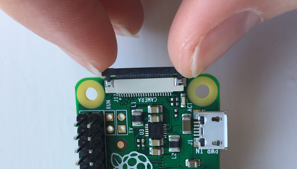

## Attaching the camera

The Pi Zero has a smaller camera port than a standard Raspberry Pi, so you will need a special camera cable with one narrower end to attach the camera for your wearable make. You can see the difference between the two cables below:

  

- On the Camera Module, locate the clip where the camera cable is attached and pull it up to release the cable. The clip works just like the one you usually use to attach the camera to the Raspberry Pi.

  

- Insert the wider end of the Pi Zero camera cable between the clip and the camera, with the exposed metal connectors facing towards the front of the camera. Push the clip down to clamp the cable in place.

  

- Pull up the camera clip on the Pi Zero. Insert the narrower end of the camera cable with the exposed metal connectors facing the underside of the Pi Zero. Push the clip down to secure the cable.

  

