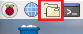
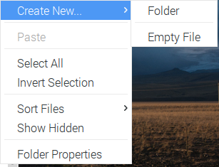
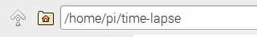

## Coding the time-lapse

--- task ---
Once the camera is set up, we need to write some code to take regular pictures. Open the file explorer, then right click on a blank space inside the file explorer window.


--- /task ---

--- task ---
Select `Create new` and then click `Folder`.


--- /task ---

--- task ---
Type in the name of the folder where you will store the code and the photographs. We chose to call ours `time-lapse`. Make a note of the path to this folder which is displayed in the bar at the top, which should be `/home/pi/time-lapse`.


--- /task ---

--- task ---
From the `Programming` menu, open up mu.
--- /task ---

[[[mu-open]]]

--- task ---
Click on `Save` and save your file into the `time-lapse` folder you just created, with the filename `time-lapse.py`.
--- /task ---

--- task ---
Add the following code to set up your Camera Module. We have deliberately set the resolution of the camera at 1024 x 768 so that the images are captured at a lower resolution. This is to allow you to make an animated gif of your time-lapse photographs. You will need to use low resolution images to make sure that the file size of the gif is not too large. If you would prefer higher or lower resolution photographs, you can change this setting.

```python
from time import sleep
import picamera

with picamera.PiCamera() as camera:
	camera.resolution = (1024, 768)
```
--- /task ---

--- task ---
We need the camera to continuously capture photographs at a set time interval. To do this, we will use the `capture_continuous` method from the picamera library. Add three lines to your code so that it looks as follows:

```python
WAIT_TIME = 30

with picamera.PiCamera() as camera:
	camera.resolution = (1024, 768)
	for filename in camera.capture_continuous('/home/pi/time-lapse/img{timestamp:%H-%M-%S-%f}.jpg'):
	sleep(WAIT_TIME)
```
--- /task ---

Let's look at what these three lines do:
  - `WAIT_TIME = 30` - sets how long we would like to wait between shots, in seconds
  - `for filename in camera.capture_continuous(` - creates an "infinite iterator" or in other words, the code will keep taking photos forever until the program is stopped
  - `'/home/pi/time-lapse/img{timestamp:%H-%M-%S-%f}.jpg'` - the filename of the picture. Notice the interesting part - `{timestamp:%H-%M-%S-%f}` - this makes the file name of the picture contain the current time (including milliseconds), so that the pictures can be organised easily into a sequence, and so that it is extremely unlikely that two pictures would have the same file name.
  - `sleep(WAIT_TIME)` - wait for the number of seconds you specified earlier

--- task ---
Press F5 to run your program, and check that it continuously takes pictures every 30 seconds. You should be able to find the pictures in the folder `/home/pi/time-lapse`.
--- /task ---

--- collapse ---
---
title: Solution
---
You can see the final code [here](resources/final-time-lapse.py)
--- /collapse ---

