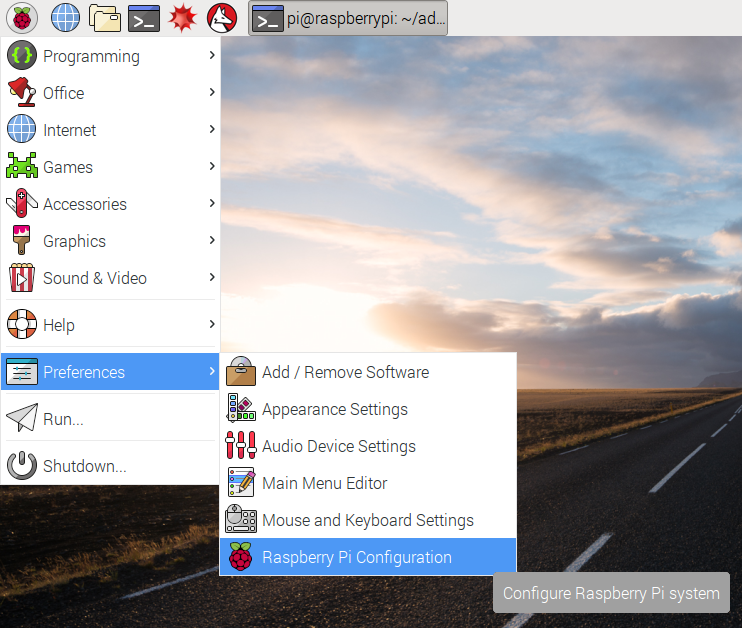
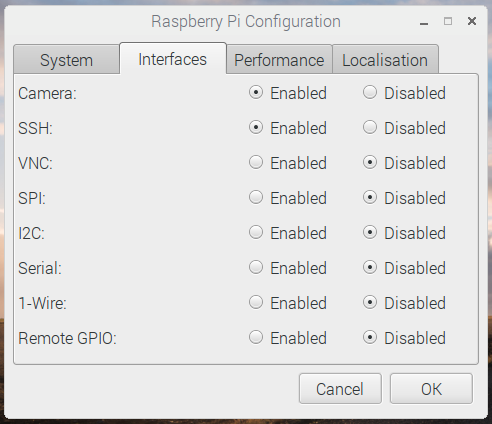

## Checking your camera

- Check that your camera is working by opening the terminal and typing the following command:

  ```bash
  raspistill -k
  ```

- You should see a camera preview (press Ctrl+C to exit). If you do not see a camera preview and instead receive an error message, check that your camera is properly connected to the Pi Zero. Also ensure that your camera is enabled by opening the Raspberry Pi configuration menu under `Preferences`:

  

  Check that the camera is set to `Enabled`. If it is not, change the setting to `Enabled` and press OK. Reboot your Pi Zero before trying the `raspistill -k` command to check that you can see a camera preview.

  

