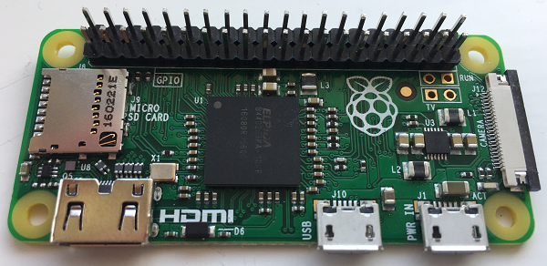
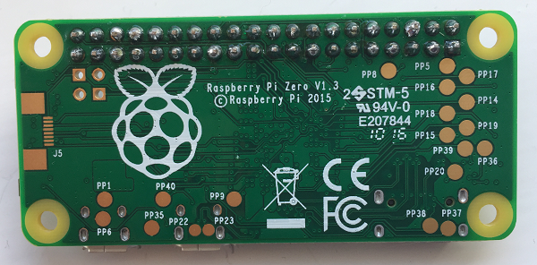

## Attaching a header to the Raspberry Pi Zero

If you would like to include the optional lights on your wearable using the Blinkt, your Pi Zero will need a male header for the Blinkt to attach to, which must be soldered on. (If you don't want to solder, you could try the [hammer header](https://shop.pimoroni.com/products/gpio-hammer-header) instead.) *The Pi Zero must be completely unplugged and powered off before you attempt any soldering.*

- If your header is longer than the number of pins needed, carefully break it off to the right length. Insert the header into the holes in the Pi Zero with the longer pins facing upwards.

  

- Keeping the header pressed in, turn both the Pi Zero and the header over. To make soldering easier, put a blob of blue tack under the Pi Zero on the long edge opposite the header to keep it level and stop it from moving around while you solder. Make sure the Pi Zero is flush with the header before beginning to solder.

- Using a soldering iron, carefully solder each of the pins on the header to the Zero, making sure there is enough solder to create a good connection for each one.

  

