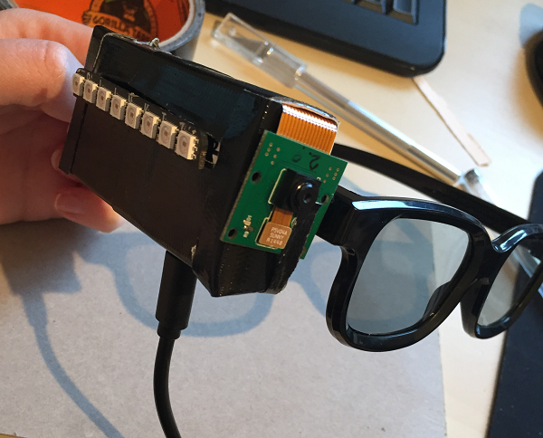
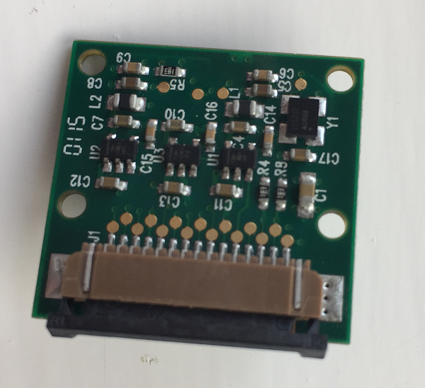
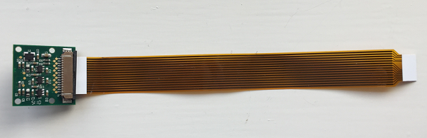
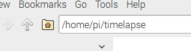
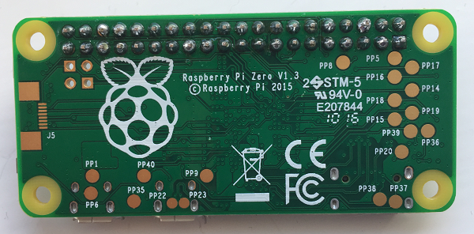
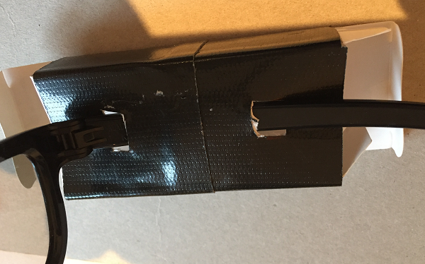

# Raspberry Pi Zero Time-Lapse Camera

In this resource you will make a wearable time-lapse camera using a Raspberry Pi Zero.

## Deciding on your wearable

First, you need to decide what kind of wearable you would like to make. The Pi Zero is very small and portable so you can wear it in various ways. Here are two examples of wearable time-lapse cameras that you could make with a Raspberry Pi Zero:

1. You could use a lanyard to make a wearable camera that hangs round your neck. Your USB power pack could be stored in a shirt pocket close to the camera. Here is a basic wearable camera setup with a soldered-on LED to alert you when a photograph is being taken, and a button which could be programmed to start and stop photo capture sequences.

  

1. You could attach your time-lapse camera to a pair of sunglasses so that it can see what you see. This make uses an additional piece of hardware called a [Blinkt](https://shop.pimoroni.com/products/blinkt), which allows the addition of a cool light pattern whenever a picture is captured. Adding these lights is completely optional. You could skip this part altogether, or you could add lights in a different way, for example by using individual LEDs.

  

1. You may have your own idea about how you would like to wear your time-lapse camera! The most important thing to remember is that your wearable time-lapse camera will not be waterproof, so don't wear it outside in the rain (or in the shower).


## Attaching the camera

The Pi Zero has a smaller camera port than a standard Raspberry Pi, so you will need a special camera cable with one narrower end to attach the camera for your wearable make. You can see the difference between the two cables below:

  

1. On the Camera Module, locate the clip where the camera cable is attached and pull it up to release the cable. The clip works just like the one you usually use to attach the camera to the Raspberry Pi.

  

1. Insert the wider end of the Pi Zero camera cable between the clip and the camera, with the exposed metal connectors facing towards the front of the camera. Push the clip down to clamp the cable in place.

  

1. Pull up the camera clip on the Pi Zero. Insert the narrower end of the camera cable with the exposed metal connectors facing the underside of the Pi Zero. Push the clip down to secure the cable.

  

## Checking your camera

1. Check that your camera is working by opening the terminal and typing the following command:

  ```bash
  raspistill -k
  ```

1. You should see a camera preview (press Ctrl+C to exit). If you do not see a camera preview and instead receive an error message, check that your camera is properly connected to the Pi Zero. Also ensure that your camera is enabled by opening the Raspberry Pi configuration menu under `Preferences`:

  

  Check that the camera is set to `Enabled`. If it is not, change the setting to `Enabled` and press OK. Reboot your Pi Zero before trying the `raspistill -k` command to check that you can see a camera preview.

  

## Coding the time-lapse

1. Once the camera is set up, we need to write some code to take regular pictures. Open the file explorer, then right click on a blank space inside the file explorer window.

  

1. Select `Create new` and then click `Folder`.

  

1. Type in the name of the folder where you will store the code and the photographs. We chose to call ours `time-lapse`. Make a note of the path to this folder which is displayed in the bar at the top, which should be `/home/pi/time-lapse`.

  

1. From the `Programming` menu, open up `Python 3`.

  

1. Create a new Python file by clicking on `File` > `New File`.

1. Click on `File` > `Save` and save your file into the `time-lapse` folder you just created, with the filename `time-lapse.py`.

1. Add the following code to set up your Camera Module. We have deliberately set the resolution of the camera at 1024 x 768 so that the images are captured at a lower resolution. This is to allow you to make an animated gif of your time-lapse photographs. You will need to use low resolution images to make sure that the file size of the gif is not too large. If you would prefer higher or lower resolution photographs, you can change this setting.

  ```python
  from time import sleep
  import picamera

  with picamera.PiCamera() as camera:
      camera.resolution = (1024, 768)
  ```

1. We need the camera to continuously capture photographs at a set time interval. To do this, we will use the `capture_continuous` method from the picamera library. Add three lines to your code so that it looks as follows:

    ```python
    WAIT_TIME = 30

    with picamera.PiCamera() as camera:
        camera.resolution = (1024, 768)
        for filename in camera.capture_continuous('/home/pi/time-lapse/img{timestamp:%H-%M-%S-%f}.jpg'):
            sleep(WAIT_TIME)
    ```

  Let's look at what these three lines do:
  - `WAIT_TIME = 30` - sets how long we would like to wait between shots, in seconds
  - `for filename in camera.capture_continuous(` - creates an "infinite iterator" or in other words, the code will keep taking photos forever until the program is stopped
  - `'/home/pi/time-lapse/img{timestamp:%H-%M-%S-%f}.jpg'` - the filename of the picture. Notice the interesting part - `{timestamp:%H-%M-%S-%f}` - this makes the file name of the picture contain the current time (including milliseconds), so that the pictures can be organised easily into a sequence, and so that it is extremely unlikely that two pictures would have the same file name.
  - `sleep(WAIT_TIME)` - wait for the number of seconds you specified earlier

1. Press F5 to run your program, and check that it continuously takes pictures every 30 seconds. You should be able to find the pictures in the folder `/home/pi/time-lapse`.

1. You can see the final code [here](code/final-time-lapse.py)

## Attaching a header to the Raspberry Pi Zero

If you would like to include the optional lights on your wearable using the Blinkt, your Pi Zero will need a male header for the Blinkt to attach to, which must be soldered on. (If you don't want to solder, you could try the [hammer header](https://shop.pimoroni.com/products/gpio-hammer-header) instead.) *The Pi Zero must be completely unplugged and powered off before you attempt any soldering.*

1. If your header is longer than the number of pins needed, carefully break it off to the right length. Insert the header into the holes in the Pi Zero with the longer pins facing upwards.

  

1. Keeping the header pressed in, turn both the Pi Zero and the header over. To make soldering easier, put a blob of blue tack under the Pi Zero on the long edge opposite the header to keep it level and stop it from moving around while you solder. Make sure the Pi Zero is flush with the header before beginning to solder.

1. Using a soldering iron, carefully solder each of the pins on the header to the Zero, making sure there is enough solder to create a good connection for each one.

  

## Setting up the software

If you are using the optional Blinkt, you will need to install the library code on your Raspberry Pi Zero. Follow the instructions on the [software page](software.md) to install the Blinkt software.

## Coding the lights

This part is optional. If you don't have a Blinkt or don't want to put lights on your time-lapse camera, you can skip this section.

1. If you have not done so already, attach the Blinkt to your Pi Zero, ensuring that it is powered off first. The Blinkt must be attached with the curved edges matching the curved edges of the Pi Zero to avoid permanently damaging it.

  

1. Once the Blinkt is attached and the Pi Zero is switched on, you can add some code to your program to control the lights.

1. Add a new line of code with the other `import` statements to import the functions we need from the blinkt library:

  ```python
  from blinkt import set_pixel, set_brightness, show, clear
  ```

1. Immediately after this line, create a function:

  ```python
  def lights():
    # Code will go here
  ```

1. Inside this function you can put the code for your own light show. Here's a very simple example:

  ```python
  def lights():
      set_brightness(0.1)
      clear()
      set_pixel(0, 255, 0, 0)
      show()
      sleep(2)
      set_pixel(0, 0, 0, 0)
      show()
  ```

  This code does the following:
  - `set_brightness(0.1)` - the lights are pretty bright, so we turned them down a bit
  - `clear()` - clears any lights which may be on
  - `set_pixel(0, 255, 0, 0)` - sets pixel 0 (the pixels are numbered 0-7 starting on the left) to red. The first number is which pixel to set, and the last three numbers are a colour in RGB format.
  - `show()` - shows the pixels in the colours you just set.
  - `sleep(2)` - wait 2 seconds

1. Add a line of code to call the function which shows the lights when a new picture is taken:

  ```python
  for filename in camera.capture_continuous('/home/pi/time-lapse/img{timestamp:%H-%M-%S-%f}.jpg'):
      lights()    # Add this line to call the light show
      time.sleep(WAIT_TIME)
  ```

1. Add your own code for a light show. When writing the code for your light sequence, make sure that you do not include an infinite loop (`while True:`) within the function. If you do this, the flow of control within your program will get stuck within this loop and your camera will not take any more pictures. In the glasses example, we used [this code](code/example_lights.py) to cause a red light to move across the screen and back twice.

## Starting the time-lapse on boot

We will be running the Pi Zero as a wearable with a USB power supply (and not with a keyboard, mouse or monitor attached), so we need a way of starting the Python script when the Zero powers on.

1. Open up a terminal window

1. At the terminal, type the following command:

  ```bash
  sudo nano ~/.config/lxsession/LXDE-pi/autostart
  ```

1. A file will open up, add this line at the bottom of the file to automatically start your time-lapse file using Python 3:

  ```bash
  sudo /usr/bin/python3 /home/pi/time-lapse/time-lapse.py
  ```

1. Press `Ctrl+X` to exit and `y` to save the changes.

1. When you reboot your Raspberry Pi, the script should run. You can test this by rebooting and then looking inside the folder `/home/pi/time-lapse` to see the photographs appearing. Note that when you reboot, Python will be running in the background. You will not see any window showing that your script is running.

## Creating the wearable

Now that your code works, it's time to work out how you will make your Pi Zero wearable. You could make anything! Design a stylish case using a 3D printer or, at the opposite end of maker chic, build box using cardboard and gaffer tape. Here is how we made the glasses, to give you an example:

1. Take a small box that the Pi Zero will fit inside. This could be a match box, or we found this old headphone box:

  

1. If you are using lights, use a craft knife to carefully cut a hole in the box big enough for the lights to show through.

  

1. Cut holes in the bottom of the box to allow access to the ports on the Pi Zero. Cut two holes in the back for the arm of the glasses. Insert the arm of the glasses through the holes to attach it to the box, being careful not to bend it too much. We covered the box with black gaffer tape to make it look cool and futuristic.

  

1. Put the Pi Zero inside the box and close the ends. You can feed the camera cable through the closed flap and secure it onto the front of the box using more gaffer tape. Make sure that the camera is the right way up!

  

1. Attach the USB power pack through the hole you cut in the bottom of the box. Turn it on to boot up the Pi Zero and start your time-lapse wearable.

## What's next?

- You can see the pictures taken by your time-lapse wearable by attaching your monitor, keyboard and mouse to the Pi Zero and navigating to the folder `/home/pi/time-lapse`. Don't forget that your time-lapse will still be taking pictures, as the program will load when the Pi Zero boots up. Alternatively, you can remove the SD card from your wearable and use it in another Raspberry Pi with a monitor, keyboard, and mouse.
- If you are using a Pi Zero W, you could [enable the VNC server](https://www.raspberrypi.org/learning/teachers-guide/remote/) to be able to view the photographs remotely from another computer.
- You could create a [gif using your time-lapse pictures](https://www.raspberrypi.org/learning/timelapse-setup/)?
- Instead of lights, could you incorporate a sensor or a button into your project to take a photograph only when the sensor is triggered?
- Could you design and 3D-print a case for your wearable? You could make something like [this one by Adafruit](https://www.raspberrypi.org/blog/wearable-pi-zero-camera/).
